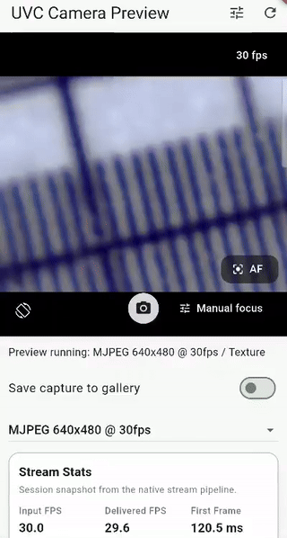
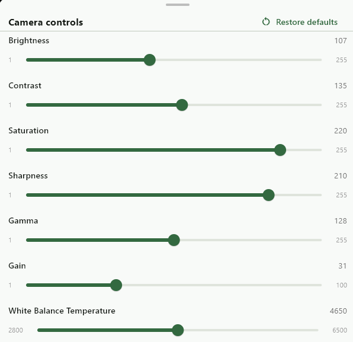

# flutter_ffi_uvc

UVC (USB Video Class) camera plugin. Connect a USB
camera and get live preview on a Flutter `Texture`, JPEG still capture, MP4
video recording, raw frame access from Dart, camera controls, and stream
diagnostics.  
Under the hood it uses `libuvc` on Android and Media Foundation on Windows.




## Supported Platforms

- Android(arm64-v8a, x86_64, armeabi-v7a)
- Windows(x64)
- Dart SDK: `>=3.8.1 <4.0.0`
- Android minSdk: `24`

## Installation

```sh
flutter pub add flutter_ffi_uvc
```

## Quick start

```dart
import 'package:flutter_ffi_uvc/flutter_ffi_uvc.dart';

// 1. Open the first attached UVC camera
//    (requests USB permission on Android; opens directly on Windows).
final devices = await uvcCamera.listUsbDevices();
await uvcCamera.openUsbDevice(devices.first.deviceId);

// 2. Start preview with automatic mode selection and attach a texture.
final int textureId = await uvcCamera.createPreviewTexture();
final result = await uvcCamera.startPreviewAuto();
if (result.success) {
  await uvcCamera.attachPreviewTexture(
    textureId,
    width: result.mode!.width,
    height: result.mode!.height,
  );
  // In your widget tree: Texture(textureId: textureId)
}

// 3-1. Take a picture: a ready-to-save JPEG.
final UvcStillPicture? picture = uvcCamera.takePicture();

// 3-2. Or grab raw RGBA pixels for ML inference, analysis, custom encoding.
final UvcPreviewFrame? frame = uvcCamera.copyLatestFrame();

// 4. Tear down.
uvcCamera.stopPreview();
await uvcCamera.disposePreviewTexture(textureId);
await uvcCamera.closeUsbDevice();
```

The sections below cover each step in detail.

## Usage

### Typical lifecycle

1. Call `uvcCamera.ensureCameraPermission()` if your app requires the `CAMERA` permission (always returns true on Windows, which has no runtime dialog).
2. Call `uvcCamera.listUsbDevices()` to discover attached UVC cameras.
3. Call `uvcCamera.openUsbDevice(deviceId)` to open the device (on Android this also requests USB permission; on Windows it opens directly).
4. Read `uvcCamera.supportedModes()`.
5. Pick a mode and call `await uvcCamera.startPreview(mode)`. This starts the stream and verifies frame delivery.
6. On success, attach a Flutter `Texture` via `attachPreviewTexture` for live preview.
7. Use `takePicture()` to capture a JPEG picture, or `copyLatestFrame()` when you need raw frame bytes in Dart.
8. Call `uvcCamera.stopPreview()` when preview is no longer needed.
9. When finished, call `uvcCamera.closeUsbDevice()`.

### Single-camera model

This plugin is designed around a single, shared global `uvcCamera` instance. It supports one connected camera at a time:

```dart
import 'package:flutter_ffi_uvc/flutter_ffi_uvc.dart';

class UvcPreviewPage extends StatefulWidget {
  UvcPreviewPage({
    super.key,
    UvcCamera? camera,
  }) : camera = camera ?? uvcCamera;

  final UvcCamera camera;
}
```

### USB Device discovery and opening

```dart
// List attached UVC cameras
final List<UvcUsbDevice> devices = await uvcCamera.listUsbDevices();

// Open a device. On Android this requests USB permission if not already granted.
final int result = await uvcCamera.openUsbDevice(devices.first.deviceId);
if (result != 0) {
  print('Open failed: ${uvcCamera.lastError}');
}
```

On Android, `openUsbDevice` requests USB permission if it has not been granted
yet; on Windows it opens the camera directly with no permission flow. It
throws a `PlatformException` if the platform layer fails, and returns a
non-zero code if the native session fails to initialize.

If another device is already open, `openUsbDevice` safely tears down the current
session first (stopping any running preview and closing the previous device), so
switching between cameras is just another `openUsbDevice` call, with no manual
`closeUsbDevice` needed in between.

To close and release the USB connection:

```dart
await uvcCamera.closeUsbDevice();
```

#### Attach / detach events

`deviceEvents` reports when a UVC-capable device is plugged in or unplugged:

```dart
StreamSubscription<UvcDeviceEvent>? _deviceEventSub;

_deviceEventSub = uvcCamera.deviceEvents.listen((UvcDeviceEvent event) {
  if (event.type == UvcDeviceEventType.detached) {
    // If this was the opened device, the native session lost its transport.
    uvcCamera.stopPreview();
    uvcCamera.closeUsbDevice();
  } else {
    // A camera was plugged in: refresh the device list, offer to open it, …
  }
});
```

This is a broadcast stream; cancel the subscription on dispose.

#### Alternative: opening by file descriptor (Android only)

If your app manages USB access independently on Android, pass the file
descriptor directly to skip the Android layer:

```dart
// fd: int from UsbDeviceConnection.fileDescriptor
uvcCamera.openFd(fd);
```

`openFd`/`closeFd` throw `UnsupportedError` on Windows, which has no file
descriptor concept; use `openUsbDevice`/`closeUsbDevice` instead.

### Preview & Capture

#### Live preview with Texture

Create a texture, start preview, then attach the texture once the stream is confirmed running:

```dart
final int textureId = await uvcCamera.createPreviewTexture();

// stableFrames (default): verifies both frame delivery and frame validity.
// sequenceOnly: verifies frame delivery only; frame validity is not checked.
final UvcPreviewStartResult result = await uvcCamera.startPreview(
  mode,
  policy: UvcPreviewPolicy.stableFrames,
);
if (result.success) {
  await uvcCamera.attachPreviewTexture(
    textureId,
    width: mode.width,
    height: mode.height,
  );
}
```

Display it with Flutter's `Texture` widget:

```dart
AspectRatio(
  aspectRatio: mode.width / mode.height,
  child: Texture(textureId: textureId),
)
```

On teardown:

```dart
uvcCamera.stopPreview();
await uvcCamera.disposePreviewTexture(textureId);
```

#### Automatic mode selection

Descriptor-reported modes are candidates, not guaranteed-safe defaults: a mode
may negotiate but never deliver decodable frames. `startPreviewAuto()` encodes
the recommended fallback loop: it tries candidate modes in order and keeps the
first one that streams and verifies successfully.

```dart
final UvcAutoPreviewResult result = await uvcCamera.startPreviewAuto();
if (result.success) {
  final UvcCameraMode mode = result.mode!; // now streaming in this mode
  await uvcCamera.attachPreviewTexture(
    textureId,
    width: mode.width,
    height: mode.height,
  );
} else {
  // Inspect per-mode failures:
  for (final UvcPreviewStartResult attempt in result.attempts) {
    print('${attempt.mode.label}: ${attempt.lastError}');
  }
}
```

By default candidates come from `supportedModes()` ordered MJPEG-first (least
likely to hit USB bandwidth limits), then by resolution and frame rate
according to `preference`, capped at `maxCandidates` (default 8):

- `UvcAutoPreviewPreference.reliability` (default): smaller resolutions
  first; attaches fastest and is least likely to hit bandwidth limits.
- `UvcAutoPreviewPreference.quality`: larger resolutions first; picks the
  best-looking mode that actually streams.

On Windows, `supportedModes()` lists every format × resolution × fps
combination the camera advertises (H264 native types excluded), so the
candidate pool is larger than on Android. H.264 modes are never part of the
default auto sequence (see [H.264 camera streams](#h264-camera-streams)).

```dart
final UvcAutoPreviewResult result = await uvcCamera.startPreviewAuto(
  preference: UvcAutoPreviewPreference.quality,
);
```

Pass `candidates` to control the order yourself; `preference` is then ignored.

#### Preview transform

Rotation and flip are applied to the Flutter `Texture` output only.

```dart
// Absolute: set rotation and flip in one call
uvcCamera.setPreviewTransform(
  const UvcPreviewTransform(rotation: 90, flipHorizontal: true),
);

// Incremental helpers
uvcCamera.rotatePreviewClockwise();          // +90° each call
uvcCamera.rotatePreviewCounterClockwise();   // -90° each call
uvcCamera.togglePreviewFlipHorizontal();     // mirror left-right
uvcCamera.togglePreviewFlipVertical();       // mirror top-bottom

// Read current state
final UvcPreviewTransform t = uvcCamera.previewTransform;
```

`rotation` accepts `0`, `90`, `180`, or `270` (clockwise degrees). Values
outside this set are normalised to `0` by the native layer.

For 90° and 270° rotations the output dimensions are swapped. Use
`applyToSize()` to get the correct dimensions for the `AspectRatio` widget:

```dart
final (int w, int h) = uvcCamera.previewTransform.applyToSize(mode.width, mode.height);
AspectRatio(
  aspectRatio: w / h,
  child: Texture(textureId: textureId),
)
```

#### Capture

To get frame bytes in Dart, call `copyLatestFrame()` while preview is running:

```dart
final UvcPreviewFrame? frame = uvcCamera.copyLatestFrame();
if (frame != null) {
  // frame.rgbaBytes: RGBA pixel data (width * height * 4 bytes)
  // frame.width, frame.height: frame dimensions
}
```

To capture with the current preview transform applied:

```dart
final UvcPreviewFrame? frame = uvcCamera.copyLatestFrameTransformed(
  uvcCamera.previewTransform,
);
```

`frame.width` and `frame.height` reflect the post-transform dimensions.

To capture a JPEG still picture without encoding RGBA yourself, call
`takePicture()` encodes the JPEG in the native layer:

```dart
final UvcStillPicture? picture = uvcCamera.takePicture(quality: 90);
if (picture != null) {
  // picture.jpegBytes: JPEG-encoded image, ready to write to a file
  // picture.width, picture.height: encoded (post-transform) dimensions
}
```

`takePicture()` applies `previewTransform` by default so the capture matches
what the preview shows; pass `transform: UvcPreviewTransform.identity` for the
raw sensor orientation.

#### Video recording

`startVideoRecording()` records the preview stream to an MP4 (H.264) file.
Frames are encoded natively (Android via MediaCodec/MediaMuxer, Windows via
the Media Foundation Sink Writer), so nothing crosses into Dart per frame,
and the live preview keeps running while recording:

```dart
// Requires an active preview (after startPreview / startPreviewAuto).
final int started = uvcCamera.startVideoRecording('/path/to/video.mp4');
if (started != 0) {
  print('Recording failed to start: ${uvcCamera.lastError}');
}

// ... later
final int stopped = uvcCamera.stopVideoRecording();
if (stopped == 0) {
  // The MP4 file is finalized and ready to play or move.
}
```

- `previewTransform` is applied by default, captured once at start; pass an
  explicit `transform` to override. `bitrateBps` defaults to a value derived
  from resolution and frame rate.
- The recording is finalized automatically when the preview stops, the mode
  changes, or the device closes, but call `stopVideoRecording()` for a
  normal finish so you know the file is complete.
- `isRecording` reports whether a recording is in progress. Audio is not
  recorded: UVC is a video-only class, and camera microphones are separate
  USB audio devices, which this package does not currently capture.

#### H.264 camera streams

Some cameras expose their highest resolutions and frame rates only as H.264
modes.

- Android: H.264 modes appear in `supportedModes()` and work with
  `startPreview()` like any other format; the texture, `copyLatestFrame()`,
  `takePicture()`, and `startVideoRecording()` all behave as usual.
  `startPreviewAuto()` never selects an H.264 mode on its own, so opt in
  with an explicit `startPreview()`. Decoding H.264 costs more than other
  formats, so depending on device performance the preview may show fewer
  frames per second than the mode's nominal rate.
- Windows: H.264 modes are not listed; the remaining formats already
  cover every advertised resolution (rationale:
  [doc/windows-backend.md](doc/windows-backend.md)).

### Controls

`supportedControls()` returns the `UvcCameraControl` list exposed by the
currently opened device, including min/max/default/current values and a
`UvcControlKind` (integer, boolean, or enum-like) describing how the value
behaves. `getControl(...)` and `setControl(...)` use typed `UvcControlId`
values instead of raw integer IDs.

Control labels are for display only. Use `UvcControlId` to identify controls in code:

```dart
final int? autoFocus = uvcCamera.getControl(UvcControlId.focusAuto);
await Future<void>.delayed(const Duration(milliseconds: 100));
uvcCamera.setControl(UvcControlId.focusAuto, autoFocus == 0 ? 1 : 0);
```

Compound UVC controls are exposed as typed APIs instead of a single integer:

```dart
final UvcPanTiltAbsoluteControl? panTilt =
    uvcCamera.getPanTiltAbsoluteControl();

if (panTilt != null) {
  uvcCamera.setPanTiltAbsoluteControl(
    UvcPanTiltAbsoluteControl(
      pan: panTilt.pan + 10,
      tilt: panTilt.tilt,
    ),
  );
}
```

For device debugging, `debugBmControls()` lists the controls a device
*advertises* without probing their values, useful when a device claims a
control but rejects reads of it. (Android only; returns an empty list on
Windows.)

### Diagnostics

#### Preview state

`uvcCamera.isPreviewing` returns `true` while the native stream callback is
active, that is, after a successful `startPreview()` and before `stopPreview()`
or device close. Use it to guard UI state or skip work when preview is not
running.

#### Frame drop behavior

When the native pipeline is still processing a frame, incoming frames are
dropped rather than queued: the preview always shows the latest frame.
Drops are visible in `getStreamStats()`.

#### Stream stats

Use `getStreamStats()` to read a `UvcStreamStats` snapshot of cumulative
native stats for the current preview session, including input/delivered FPS,
decode failures, dropped frames, inter-frame gap timing, and first-frame
latency.

Stats reset when a new `startPreview()` session begins.

#### Streaming error reporting

Frame pipeline errors (decode failures, undersized frames, buffer allocation
failures) are delivered proactively via `streamErrors` rather than being
silently stored in `lastError`.

Subscribe once when the widget is initialised and cancel on dispose:

```dart
StreamSubscription<UvcStreamError>? _streamErrorSub;

@override
void initState() {
  super.initState();
  _streamErrorSub = uvcCamera.streamErrors.listen((UvcStreamError error) {
    // handle error, e.g. show a SnackBar
    print(error.message);
  });
}

@override
void dispose() {
  _streamErrorSub?.cancel();
  super.dispose();
}
```

`streamErrors` is a broadcast stream, so multiple subscribers are allowed.

#### Stall detection and recovery

Some devices keep the stream "running" while silently delivering no frames.
Enable the watchdog to detect this and optionally recover:

```dart
uvcCamera.enableStallDetection(
  const UvcStallDetectionConfig(
    stallTimeout: Duration(seconds: 2),
    autoRestart: true,
    maxRestartAttempts: 3,
  ),
);

uvcCamera.stallEvents.listen((UvcStallEvent event) {
  switch (event.type) {
    case UvcStallEventType.stalled:
      // No frames for `event.silence` while previewing.
      break;
    case UvcStallEventType.restartSucceeded:
      // Preview is running again (attempt `event.restartAttempt`).
      break;
    case UvcStallEventType.restartFailed:
      // `event.restartResult` holds the failed verification details.
      break;
  }
});
```

A stall is declared when the delivered frame sequence stops advancing for
`stallTimeout` while `isPreviewing` is true, and is reported once per stall
episode. With `autoRestart`, the preview is stopped and restarted with the
parameters of the most recent `startPreview` call; the attempt counter resets
once frames flow again. Detection stays enabled across preview sessions until
`disableStallDetection()`.

#### Typed error codes

APIs that return raw `int` codes use the same error-code space on both
platforms. `UvcErrorCode` gives them names, and `UvcException` is available
for throw-style handling in app code:

```dart
final UvcPreviewStartResult result = await uvcCamera.startPreview(mode);
if (!result.success) {
  if (result.errorCode == UvcErrorCode.noDevice) {
    // Device disconnected or never opened.
  }
  // Or wrap it:
  throw UvcException.fromNativeCode(
    result.nativeErrorCode,
    message: result.lastError ?? '',
  );
}
```

`UvcPreviewStartResult.nativeErrorCode` is non-zero only when stream startup
itself failed; verification failures report through `lastError` and the frame
counters instead.

### Logging

You can change the log level for the underlying native layer at runtime:

```dart
uvcCamera.setLogLevel(UvcLogLevel.warn);
```

Available levels are:

- `UvcLogLevel.error`
- `UvcLogLevel.warn`
- `UvcLogLevel.info`
- `UvcLogLevel.debug`
- `UvcLogLevel.trace`

If you do not call `uvcCamera.setLogLevel(...)`, the package defaults to `UvcLogLevel.info`.
Native logs are emitted on Android (logcat); the Windows backend reports
problems through `streamErrors` and `lastError` instead of log output.

## Example app

A demo app lives in the `example/` directory at the root of this
repository.

## Licensing

This package is licensed under the BSD 3-Clause License. 
Bundled third-party components keep their own licenses.

See [THIRD_PARTY_NOTICES.md](THIRD_PARTY_NOTICES.md) for bundled dependency
license notices, including `libuvc`, `libusb`, and `libjpeg-turbo`