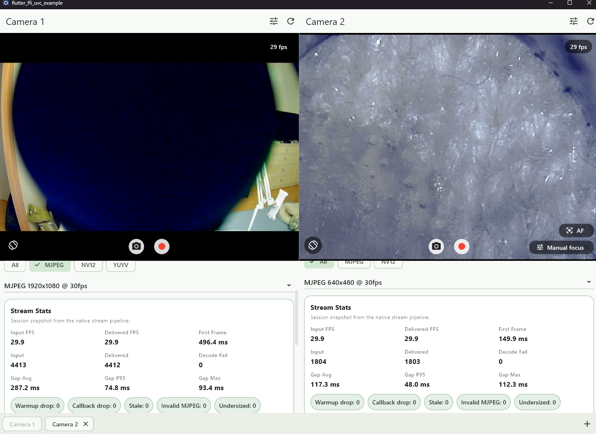

# flutter_ffi_uvc

UVC (USB Video Class) camera plugin. Connect one or several USB cameras and
get live preview on a Flutter `Texture`, JPEG still capture, MP4 video
recording, raw frame access from Dart, camera controls, and stream
diagnostics.  
Under the hood it uses `libuvc` on Android and Linux, and Media Foundation
on Windows.




## Supported Platforms

- Android(arm64-v8a, x86_64, armeabi-v7a)
- Windows(x64)
- Linux(x64): see [Linux setup](#linux-setup) for camera access
- Dart SDK: `>=3.8.1 <4.0.0`
- Android minSdk: `24`

## Installation

```sh
flutter pub add flutter_ffi_uvc
```

## Quick start

```dart
import 'package:flutter_ffi_uvc/flutter_ffi_uvc.dart';

// 1. Open the first attached UVC camera
//    (requests USB permission on Android, opens directly elsewhere).
final devices = await uvcCamera.listUsbDevices();
await uvcCamera.openUsbDevice(devices.first.deviceId);

// 2. Start preview with automatic mode selection and attach a texture.
final int textureId = await uvcCamera.createPreviewTexture();
final result = await uvcCamera.startPreviewAuto();
if (result.success) {
  await uvcCamera.attachPreviewTexture(
    textureId,
    width: result.mode!.width,
    height: result.mode!.height,
  );
  // In your widget tree: Texture(textureId: textureId)
}

// 3-1. Take a picture: a ready-to-save JPEG.
final UvcStillPicture? picture = uvcCamera.takePicture();

// 3-2. Or grab raw RGBA pixels for ML inference, analysis, custom encoding.
final UvcPreviewFrame? frame = uvcCamera.copyLatestFrame();

// 4. Tear down.
await uvcCamera.stopPreview();
await uvcCamera.disposePreviewTexture(textureId);
await uvcCamera.closeUsbDevice();
```

The sections below cover each step in detail.

## Usage

### Camera instances

One `UvcCamera` instance drives one camera. `uvcCamera` is a ready-made
shared instance for apps that use a single camera.

To stream several cameras at once, create an instance per camera. Call
`dispose()` when an instance is no longer needed. It stops the preview and
closes the device. Textures you created still need `disposePreviewTexture`.

```dart
final UvcCamera front = UvcCamera();
final UvcCamera rear = UvcCamera();

await front.openUsbDevice(devices[0].deviceId);
await rear.openUsbDevice(devices[1].deviceId);
// ... preview, capture, record on each independently

await front.dispose();
await rear.dispose();
```

A device already open in another instance of this app fails with
`UvcErrorCode.busy`. Cameras held by other processes cannot be detected in
advance and fail at open instead.

Lifecycle calls on one instance run one at a time, in call order.
`stopPreview()`, `closeUsbDevice()`, and `dispose()` end a start in
progress, which then reports `UvcErrorCode.interrupted`.

Two cameras behind one USB 2.0 hub, or on a phone's single port, share one
bus. The second stream may then only start in a lower mode or fail, and
`startPreviewAuto()` falls back to smaller modes. On a desktop, separate
root ports give each camera its own bus.

### USB Device discovery and opening

```dart
// List attached UVC cameras
final List<UvcUsbDevice> devices = await uvcCamera.listUsbDevices();

// Open a device. On Android this requests USB permission if not already granted.
try {
  await uvcCamera.openUsbDevice(devices.first.deviceId);
} on UvcException catch (error) {
  print('Open failed: $error');
}
```

A `PlatformException` means the platform layer failed, for example a denied
USB permission. On Linux the device node must be accessible, see
[Linux setup](#linux-setup).

If a device is already open, `openUsbDevice` closes it first, so switching
cameras is just another `openUsbDevice` call.

To close and release the USB connection:

```dart
await uvcCamera.closeUsbDevice();
```

#### Attach / detach events

`deviceEvents` reports when a UVC-capable device is plugged in or unplugged:

```dart
StreamSubscription<UvcDeviceEvent>? _deviceEventSub;

_deviceEventSub = uvcCamera.deviceEvents.listen((UvcDeviceEvent event) {
  if (event.type == UvcDeviceEventType.detached &&
      event.device.deviceId == uvcCamera.openedDeviceId) {
    // The package closes the device right after this handler returns.
    // Update the UI.
  } else if (event.type == UvcDeviceEventType.attached) {
    // A camera was plugged in: refresh the device list, offer to open it, …
  }
});
```

This is a broadcast stream shared by every instance. Cancel the subscription
on dispose. `openedDeviceId` is the device id an instance currently holds
open.

### Preview & Capture

#### Live preview with Texture

Create a texture, start preview, then attach the texture once the stream is confirmed running:

```dart
final int textureId = await uvcCamera.createPreviewTexture();

// stableFrames (default): verifies both frame delivery and frame validity.
// sequenceOnly: verifies frame delivery only; frame validity is not checked.
final UvcPreviewStartResult result = await uvcCamera.startPreview(
  mode,
  policy: UvcPreviewPolicy.stableFrames,
);
if (result.success) {
  await uvcCamera.attachPreviewTexture(
    textureId,
    width: mode.width,
    height: mode.height,
  );
}
```

Display it with Flutter's `Texture` widget:

```dart
AspectRatio(
  aspectRatio: mode.width / mode.height,
  child: Texture(textureId: textureId),
)
```

On teardown:

```dart
await uvcCamera.stopPreview();
await uvcCamera.disposePreviewTexture(textureId);
```

#### Automatic mode selection

Descriptor-reported modes are candidates, not guaranteed-safe defaults. A mode
may negotiate but never deliver decodable frames. `startPreviewAuto()` encodes
the recommended fallback loop. It tries candidate modes in order and keeps the
first one that streams and verifies successfully.

```dart
final UvcAutoPreviewResult result = await uvcCamera.startPreviewAuto();
if (result.success) {
  final UvcCameraMode mode = result.mode!; // now streaming in this mode
  await uvcCamera.attachPreviewTexture(
    textureId,
    width: mode.width,
    height: mode.height,
  );
} else {
  // Inspect per-mode failures:
  for (final UvcPreviewStartResult attempt in result.attempts) {
    print('${attempt.mode.label}: ${attempt.lastError}');
  }
}
```

By default candidates come from `supportedModes()` ordered MJPEG-first (least
likely to hit USB bandwidth limits), then by resolution and frame rate
according to `preference`, capped at `maxCandidates` (default 8):

- `UvcAutoPreviewPreference.reliability` (default): smaller resolutions
  first. Attaches fastest and is least likely to hit bandwidth limits.
- `UvcAutoPreviewPreference.quality`: larger resolutions first. Picks the
  best-looking mode that actually streams.

Pass `candidates` to control the order yourself. `preference` is then ignored.

#### Preview transform

Rotation and flip are applied to the Flutter `Texture` output only.

```dart
// Absolute: set rotation and flip in one call
uvcCamera.setPreviewTransform(
  const UvcPreviewTransform(rotation: 90, flipHorizontal: true),
);

// Incremental helpers
uvcCamera.rotatePreviewClockwise();          // +90° each call
uvcCamera.rotatePreviewCounterClockwise();   // -90° each call
uvcCamera.togglePreviewFlipHorizontal();     // mirror left-right
uvcCamera.togglePreviewFlipVertical();       // mirror top-bottom

// Read current state
final UvcPreviewTransform t = uvcCamera.previewTransform;
```

`rotation` accepts `0`, `90`, `180`, or `270` (clockwise degrees).

For 90° and 270° rotations the output dimensions are swapped. Use
`applyToSize()` to get the correct dimensions for the `AspectRatio` widget:

```dart
final (int w, int h) = uvcCamera.previewTransform.applyToSize(mode.width, mode.height);
AspectRatio(
  aspectRatio: w / h,
  child: Texture(textureId: textureId),
)
```

#### Capture

To get frame bytes in Dart, call `copyLatestFrame()` while preview is running:

```dart
final UvcPreviewFrame? frame = uvcCamera.copyLatestFrame();
if (frame != null) {
  // frame.rgbaBytes: RGBA pixel data (width * height * 4 bytes)
  // frame.width, frame.height: frame dimensions
}
```

To capture with the current preview transform applied:

```dart
final UvcPreviewFrame? frame = uvcCamera.copyLatestFrameTransformed(
  uvcCamera.previewTransform,
);
```

`frame.width` and `frame.height` reflect the post-transform dimensions.

`takePicture()` returns a JPEG encoded in the native layer:

```dart
final UvcStillPicture? picture = uvcCamera.takePicture(quality: 90);
if (picture != null) {
  // picture.jpegBytes: JPEG-encoded image, ready to write to a file
  // picture.width, picture.height: encoded (post-transform) dimensions
}
```

`takePicture()` applies `previewTransform` by default so the capture matches
what the preview shows. Pass `transform: UvcPreviewTransform.identity` for the
raw sensor orientation.

#### Video recording

`startVideoRecording()` records the preview stream to an MP4 (H.264) file.
Encoding happens natively and the preview keeps running while recording:

```dart
// Requires an active preview (after startPreview / startPreviewAuto).
try {
  uvcCamera.startVideoRecording('/path/to/video.mp4');
} on UvcException catch (error) {
  print('Recording failed to start: $error');
}

// ... later
uvcCamera.stopVideoRecording();
// The MP4 file is finalized and ready to play or move.
```

- `previewTransform` is applied by default, captured once at start. Pass an
  explicit `transform` to override. `bitrateBps` defaults to a value derived
  from resolution and frame rate.
- The recording is finalized automatically when the preview stops, the mode
  changes, or the device closes, but call `stopVideoRecording()` for a
  normal finish so you know the file is complete.
- `isRecording` reports whether a recording is in progress. Audio is not
  recorded.
- Recording is available on Android and Windows. On Linux
  `startVideoRecording()` throws. Use `takePicture()` and `copyLatestFrame()`
  there.

#### H.264 camera streams

On Android, H.264 modes are listed in `supportedModes()` and work like any
other format, but `startPreviewAuto()` never selects them. Opt in with an
explicit `startPreview()`. Windows and Linux do not list H.264 modes. The
other formats cover every advertised resolution.

### Controls

`supportedControls()` lists the controls of the open device with their
ranges and current values. `getControl()` and `setControl()` address them by
`UvcControlId`:

```dart
final int? autoFocus = uvcCamera.getControl(UvcControlId.focusAuto);
uvcCamera.setControl(UvcControlId.focusAuto, autoFocus == 0 ? 1 : 0);
```

Compound UVC controls are exposed as typed APIs instead of a single integer:

```dart
final UvcPanTiltAbsoluteControl? panTilt =
    uvcCamera.getPanTiltAbsoluteControl();

if (panTilt != null) {
  uvcCamera.setPanTiltAbsoluteControl(
    UvcPanTiltAbsoluteControl(
      pan: panTilt.pan + 10,
      tilt: panTilt.tilt,
    ),
  );
}
```

`debugBmControls()` lists the controls a device advertises without probing
them, for devices that advertise a control but reject reads of it. Android
and Linux only.

### Diagnostics

#### Frame drop behavior

When the native pipeline is still processing a frame, incoming frames are
dropped rather than queued. The preview always shows the latest frame.
Drops are visible in `getStreamStats()`.

#### Stream stats

`getStreamStats()` returns a snapshot of the native stats for the current
preview, such as delivered FPS, decode failures, and dropped frames. They
reset on each start.

#### Streaming error reporting

Frame pipeline errors (decode failures, undersized frames, buffer allocation
failures) are delivered through `streamErrors`, a broadcast stream:

```dart
final StreamSubscription<UvcStreamError> sub =
    uvcCamera.streamErrors.listen((UvcStreamError error) {
  print(error.message);
});
// ... later
await sub.cancel();
```

#### Stall detection and recovery

Some devices keep the stream "running" while silently delivering no frames.
Enable the watchdog to detect this and optionally recover:

```dart
uvcCamera.enableStallDetection(
  const UvcStallDetectionConfig(
    stallTimeout: Duration(seconds: 2),
    autoRestart: true,
    maxRestartAttempts: 3,
  ),
);

uvcCamera.stallEvents.listen((UvcStallEvent event) {
  switch (event.type) {
    case UvcStallEventType.stalled:
      // No frames for `event.silence` while previewing.
      break;
    case UvcStallEventType.restartSucceeded:
      // Preview is running again (attempt `event.restartAttempt`).
      break;
    case UvcStallEventType.restartFailed:
      // `event.restartResult` holds the failed verification details.
      break;
  }
});
```

A stall is reported once per episode when no frame arrives for
`stallTimeout` while previewing. With `autoRestart` the preview is restarted
with the last `startPreview` parameters, up to `maxRestartAttempts` per
episode. Detection stays enabled until `disableStallDetection()`.

#### Errors

Calls that fail throw `UvcException`, which carries a `UvcErrorCode` and the
native message. `startPreview()` and `startPreviewAuto()` return a result
instead, with the same code in `errorCode`:

```dart
try {
  await uvcCamera.openUsbDevice(deviceId);
} on UvcException catch (error) {
  if (error.code == UvcErrorCode.busy) {
    // Another instance holds this device.
  }
}

final UvcPreviewStartResult result = await uvcCamera.startPreview(mode);
if (!result.success && result.errorCode == UvcErrorCode.noDevice) {
  // Device disconnected or never opened.
}
```

`UvcPreviewStartResult.errorCode` is set when stream startup itself failed,
when no device was open (`noDevice`), or when a stop, close, or dispose ended
the verification early (`interrupted`). Verification failures report through
`lastError` and the frame counters instead.

### Logging

`setLogLevel()` sets the native log level for every instance. The default
is `UvcLogLevel.info`.

```dart
uvcCamera.setLogLevel(UvcLogLevel.warn);
```

Native logs go to logcat on Android and stderr on Linux. The Windows backend
reports problems through `streamErrors` and `lastError` instead.

## Linux setup

The app opens the camera's `/dev/bus/usb` node directly, so it needs
read-write access. Grant it with a udev rule (vendor and product ids from
`lsusb`). Without it, `openUsbDevice` fails with a `PlatformException`
naming the device node.

```sh
echo 'SUBSYSTEM=="usb", ATTRS{idVendor}=="xxxx", ATTRS{idProduct}=="xxxx", MODE="0666"' \
  | sudo tee /etc/udev/rules.d/99-uvc.rules

sudo udevadm control --reload-rules
```

Optional: install `nasm` before building for faster MJPEG decode
(libjpeg-turbo x86_64 SIMD).

## Example app

A demo app lives in the `example/` directory at the root of this
repository.

## Licensing

This package is licensed under the BSD 3-Clause License. 
Bundled third-party components keep their own licenses.

See [THIRD_PARTY_NOTICES.md](THIRD_PARTY_NOTICES.md) for bundled dependency
license notices, including `libuvc`, `libusb`, and `libjpeg-turbo`